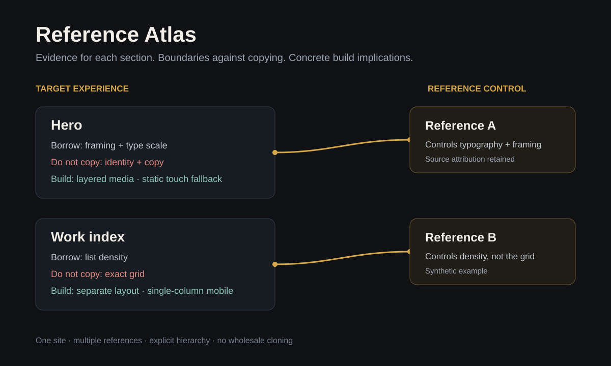

# Reference Atlas

A section-level method for building ambitious websites from multiple visual
references without cloning any one source.

The atlas maps each target section to its sources, the exact traits to borrow,
what must not be copied, mobile behavior and implementation implications. It
turns “make it cinematic” into inspectable design evidence.

This workflow was adapted from a portfolio-building walkthrough by
[@monokern](https://x.com/monokern/status/2071246711222055363), then extended with
reference hierarchy, attribution, mobile behavior, accessibility, performance and
browser-verification records. No source code from that walkthrough is included.



The visual is synthetic—not a screenshot of verified work. The
[v2 example](examples/atlas-v2.json) includes real synthetic evidence and a
[rendered handoff](docs/example-atlas-v2.md); its implementation checks honestly
remain `not_checked`. The [legacy example](docs/example-atlas.md) remains supported.

## Install

Python 3.10 or newer. The application has **no runtime dependencies**.

```sh
git clone https://github.com/sapochat/reference-atlas.git
cd reference-atlas
python3 -m venv .venv
.venv/bin/pip install -e .
```

The commands below use `reference-atlas`; activate `.venv` or invoke
`.venv/bin/reference-atlas` directly. Installation requires access to build
packages unless they are cached. Authoring, checking and rendering work offline.

## Start an atlas

```sh
reference-atlas --init atlas.json
reference-atlas atlas.json --check --diagnostics json
reference-atlas atlas.json handoff.md --layout sections
```

The packaged starter is a valid v2 draft, **not a ready or verified design**.
Replace its `TBD` text with real decisions and leave checks unverified until the
work has actually been tested. It invents no references, assets or passed checks.

For the full collect → attribute → map → check → review → implement → verify
loop, read [the workflow](docs/workflow.md).

## Inspect and render

```sh
# Check without writing files; warnings do not fail a normal check.
reference-atlas examples/atlas-v2.json --check

# Structured issues and explicit local-file evidence checks; never fetch URLs.
reference-atlas examples/atlas-v2.json --check --check-assets --diagnostics json

# This synthetic draft intentionally exits 2: checks are still not_checked.
reference-atlas examples/atlas-v2.json --check --strict

# Both layouts preserve the handoff's information.
reference-atlas examples/atlas-v2.json handoff.md --layout sections
reference-atlas examples/atlas-v2.json overview.md --layout table

# Original two-positional invocation remains supported.
reference-atlas examples/atlas.json legacy.md
```

- **Default layouts:** legacy uses its original seven-column table; v2 uses
  sections. `--layout sections` works with both. V2 `--layout table` includes an
  overview and full details rather than dropping evidence into a tiny table.
- **Valid versus ready:** structure and source references can be sound while
  evidence or checks are incomplete. `--strict` fails on warnings. It does not
  independently certify recorded results, design quality or usage rights.
- **Local assets:** paths resolve relative to the atlas file and must stay within
  its declared `asset_root`. Remote URLs are never fetched. Checking file
  existence does not establish provenance, visual fidelity or licensing rights.
- **Compatibility:** unversioned and explicit v1 documents still work. Legacy
  extras warn; v2 unknown fields fail. No automatic migration or invented links.

See the [format contract](docs/format.md) and
[JSON Schema](schemas/atlas-v2.schema.json). The Python API exports
`validate_atlas(data)`, `inspect_atlas(data, ...)` and
`render_markdown(data, layout=...)`.

## File safety and errors

Existing destinations require explicit `--force`. Source files—including hardlink
and symlink aliases—cannot be replaced by conversion, even with `--force`.
Destination symlinks, directories and special files are rejected. Output is
prepared before atomic publication, and routine failures preserve existing files.
On POSIX, new outputs use normal file permissions filtered by your umask;
`--force` preserves an existing destination's ordinary permission bits, but not
setuid, setgid or sticky bits. Ownership, ACLs and extended attributes are not
preserved by replacement.
Initialization creates only its requested file, not parent directories or assets.

```sh
reference-atlas examples/atlas-v2.json handoff.md --force
reference-atlas --init atlas.json --force
```

`--init` cannot be combined with positional conversion inputs or inspection/layout
flags. `--layout` is a rendering option, not a check option. JSON diagnostics are
available with `--check --diagnostics json`.

Exit codes:

- **0:** successful initialization, rendering or ordinary check (possibly warnings).
- **2:** incorrect arguments, invalid JSON/data/UTF-8, decoder limits, duplicate
  JSON keys, or a strict check/render blocked by warnings.
- **3:** input/output filesystem failures, including a refused destination.

Routine failures have concise diagnostics; unexpected programming errors remain
observable. Author-supplied fields are **literal text**: Markdown/HTML cannot be
used to inject document structure. The original example's output stays unchanged.
These protections do not claim power-loss durability or resistance to hostile
concurrent replacement of parent directories.

## Development and distribution verification

```sh
.venv/bin/pip install -r requirements-test.txt build
.venv/bin/python -m unittest discover -s tests -v
.venv/bin/python scripts/verify_distribution.py
```

Test dependencies are separate from the application. CI runs Python 3.10, 3.12
and 3.14 on Ubuntu. Distribution verification builds an sdist, builds a wheel
from that sdist, runs shipped tests with their fixtures and exercises the installed
command outside the source checkout. Builds/installations may need network access;
the installed CLI does not.

The wheel includes a starter and schema via `importlib.resources`.
`SKILL.md`, the workflow, examples and test fixtures are repository/source-distribution
resources, not automatically installed Hermes skills. See
[release notes](CHANGELOG.md) for compatibility changes.

MIT licensed. Attribution is documented in [ATTRIBUTION.md](ATTRIBUTION.md).
